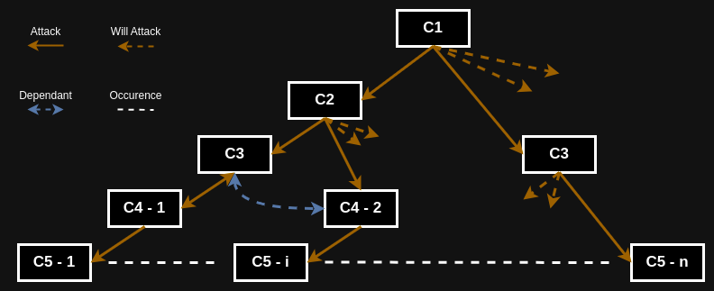

# Prismforce-ASDE-Algorithm-Test

## Problem Statement
Imagine Abhimanyu in Chakravyuha. There are 11 circles in the Chakravyuha surrounded by different enemies. Abhimanyu is located in the innermost circle and has to cross all the 11 circles to reach Pandavas army back.

### Given:
- Each circle is guarded by different enemies where the enemy is equipped with $k_1, k_2, \ldots, k_{11}$ powers. 
- Abhimanyu starts from the innermost circle with $p$ power.
- Abhimanyu has a boon to skip fighting enemy $a$ times.
- Abhimanyu can recharge himself with power $b$ times.
- Battling in each circle will result in the loss of the same power from Abhimanyu as the enemy.
- If Abhimanyu enters the circle with energy less than the respective enemy, he will lose the battle.
- $k_3$ and $k_7$ enemies are endowed with the power to regenerate themselves once with half of their initial power and can attack Abhimanyu from behind if he is battling in iteratively next circle.

Write an algorithm to find if Abhimanyu can cross the Chakravyuh and test it with two sets of test cases.

## Intuition with Solution (Step by Step):
As the number of circles is very few, we can solve it using **BACKTRACKING** including all combinations of fighting, skipping, and recharging.

### Why not Dynamic Programming?
Let's denote:
* The set of circles as $C(i):\ i\ \epsilon\ [1, 11]$.
* Abhimanyu's power as $p_j:\ j\ \forall\ C(i):\ i\ \epsilon\ [1, 11]$.
* The power of the enemy as $k_i\ :\ i\ \epsilon\ [1, 11]$.
* The number of skips available as $a$.
* The number of recharges available as $b$.
* $R(k) = \frac{k}{2}$ as the regenerated power of $k_3$ and $k_7$.

#### State Representation:
The state at circle $i$ can be represented as $(i,\ p_j,\ a,\ b)$.

As you can see from the given State transition tree, till $C_3$ the problems can be divided into sub-problems but from $C_4$ it cannot be divided as it is co-dependent on the value of $C_3$ when skipped ($k[2]$) and when not-skipped ($\frac{k[2]}{2}$). So for the same previous transition, it would lead to different values of $C_4$ such as $C_4 - i$ where $i\ \epsilon\ [1, n]$ where $n$ is the number of previous transition states.

### Why not Greedy?
1. **Regeneration Power of $k_3$ and $k_7$**: Since $k_3$ and $k_7$ can regenerate and attack from behind, a locally optimal choice in earlier circles might result in a suboptimal situation when dealing with these regenerating enemies. A greedy approach cannot foresee such scenarios and adjust accordingly.
2. **Skipping and Recharging Decisions**: The decision to skip or recharge should be made considering future circles. A greedy approach might waste skips or recharges early on without realizing their necessity in later circles.

### Implementing Backtracking:

There will be basically 2 Backtracking conditions:
1) Skipping
2) Attacking

Let's denote:
* The set of circles as $C(i):\ i\ \epsilon\ [1, 11]$.
* Abhimanyu's power as $p_j:\ j\ \forall\ C(i):\ i\ \epsilon\ [1, 11]$.
* The power of the enemy as $k_i\ :\ i\ \epsilon\ [1, 11]$.
* The number of skips available as $a$.
* The number of recharges available as $b$.
  [Notice how after splitting the backtracking into 2 conditions we don't need to take care of recharging separately now, because it will now only be used in attacking when power is not enough]
  [So changing variable $b\ \Longrightarrow\ b_j:\ j\ \forall\ C(i):\ i\ \epsilon\ [1, 11]$
#### State Representation: $C(k,\ p_j,\ a,\ b_j,\ i)$

#### Backtracking conditions:
##### 1 - For Skipping(a):
$$
C(S_k)\ =\ C(k,\ p_j,\ a,\ b_j,\ i)=
\begin{cases}
C(k,\ p_j,\ a\ -\ 1,\ b_j,\ i\ +\ 1),\\
C(k,\ p_j,\ a,\ b_j,\ i\ +\ 1)
\end{cases}
$$
##### 2 - For Attacking:
Let R = \{4, 8\}

$$
C(k,\ p_j,\ a,\ b_j,\ i)=
\begin{cases}
C(k,\ p_j\ -\ k[i]\ -\ (k[i\ -\ 1]\ \forall\ C(S_k)),\ a,\ b_j,\ i\ +\ 1), & & for\ i\ \epsilon\ R\\
C(k,\ p_j\ -\ k[i],\ a,\ b_j,\ i\ +\ 1), & & for\ i\ \not\epsilon\ R
\end{cases}
$$

### Time Complexity:
Since the Transition States depends upon Skipped and Attacked transition states we just have to find total number of ways we can arrange the skipped transition states in all 11 circles.

Hence, TC: $\mathbf{O}(\prescript{11}{a}{\mathbf{C}})\ :\ a\ \epsilon\ [1,\ 11]$

### Testcases:
$\because$ The Time Complexity is $\mathbf{O}(\prescript{11}{a}{\mathbf{C}})$

$\therefore$ The max(TC) will be: ($\frac{11!}{5!\ *\ 6!}$)

$\therefore$ TC < 1e3

Hence, we can put number of testcases($T_n$) in each testset: $T_n\ \leq\ 2e4$ 

$\therefore$ $T_n\ *\ TC$ < 1e8,

i.e: $T_n\ *\ TC$ <= 1-sec (This would make an appropriate standard testset for a problem statement)

#### Testset_1:
This testset contains all the possible cases (mostly corner cases) for standard validation testing.

Test-Generation:
* Take Rotated sorted array (of Random elements) at each index(i) (11 possible indexes).
* Take all possible powers(p) for each prefix sum indexes (so it checks from least to most) (12 possible).
* Take all possible skips(a) (12 possible).
* Take all possible recharges(b) (12 possible).

Hence, Total number of Tescases = i * p * a * b = 19008 (testcases)

#### Testset_2:
This testset contains all random elements for both double(floating-type) and int numbers.
This is for accuracy/precision testing.
Total Number of Tescases = 10000 (testcases)
  
